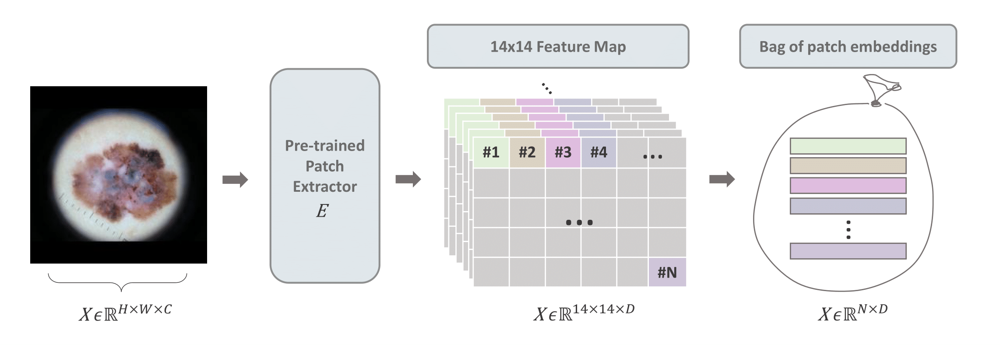
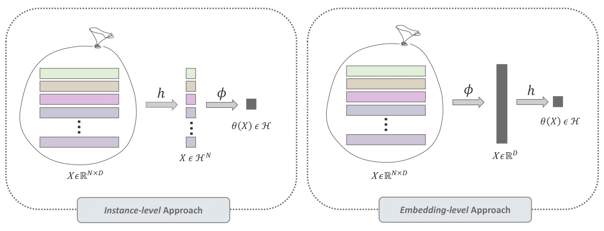
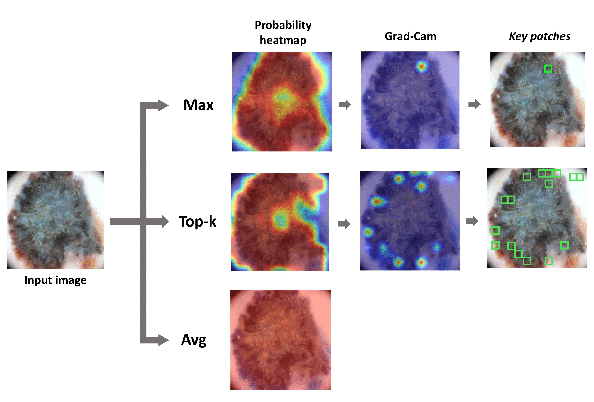

# Multiple Instance Learning (MIL) Branch for Medical Image Processing

## Introduction

The MIL branch of this project addresses critical questions in dermoscopy image analysis by focusing on the relevance and spatial positioning of patches within an image. It is a part of a larger pipeline that includes an EViT branch and operates on medical images. This branch is crucial for understanding the role of patches in cancer diagnosis through weakly supervised learning.

The MIL branch comprises two fundamental components: a deep patch extractor and a MIL classifier. In the following sections, we will explore the constituent blocks of the MIL branch in more detail. Our approach introduces a two-step method for generalizing binary MIL classifiers and extends it to a three-step method for multi-class classification.

## MIL Classifier Architecture

### Feature Extractor

The first component of the MIL branch is a deep patch extractor denoted as E, responsible for generating
a 14 × 14 feature map.




Several options for feature extractors are integrated into the model, allowing for flexibility and adaptability to different types of image data.

### Binary Classification

For binary classification, the model employs a two-step approach that operates on a bag of embedded instances (X ∈ R^(N×D)). It utilizes two key functions:
- A non-linear classifier `h`, representing an instance-level classifier, which provides the probability of the positive class for each patch.
- A permutation-invariant aggregation function `ϕ`, which combines individual patch probabilities into a bag probability.

The order of these two function determines the type of MIL classifier: instance-level or embedding-level.



### Multi-Class Classification

The three-step method for multi-class MIL extends the binary approach with the following functions:
- `z`: A linear layer mapping the input to the number of classes.
- `ϕ`: A permutation-invariant aggregation function.
- `σ`: The softmax function, which, in binary scenarios, is replaced by a sigmoid activation function.

Both approaches consider the permutation invariance required for MIL models, accommodating various pooling functions like max, avg, and topk.

## Visualization of Pooling Functions

The model allows visualization of the different pooling functions: max, avg, and topk. These visualizations can provide insights into the areas within the patches that are most indicative of skin cancer.



## Image Processing Capability

The MIL model is designed to process dermoscopic RGB images and greyscale mammography images, supporting publicly available datasets such as ISIC2019, PH2, Derm7pt, DDSM, an others. 

## Usage

This branch is only a component of a more extensive medical model and is structured to be used in conjunction with other branches, like the EViT branch, for comprehensive analysis.

To use this MIL model branch in your pipeline, follow these steps:

1. Install the required dependencies by running:

```bash
pip install -r requirements.txt
```

<!-- TODO: Add the correct paths for the images in the markdown links below -->

2. After the dependencies are installed, you can begin training the model with the provided script:
```bash
bash train.sh
```

Ensure you have the proper environment and permissions to execute the script on your system.


For a detailed understanding of the MIL branch and its role in the larger context, please refer to the extended abstract and paper associated with this repository.
